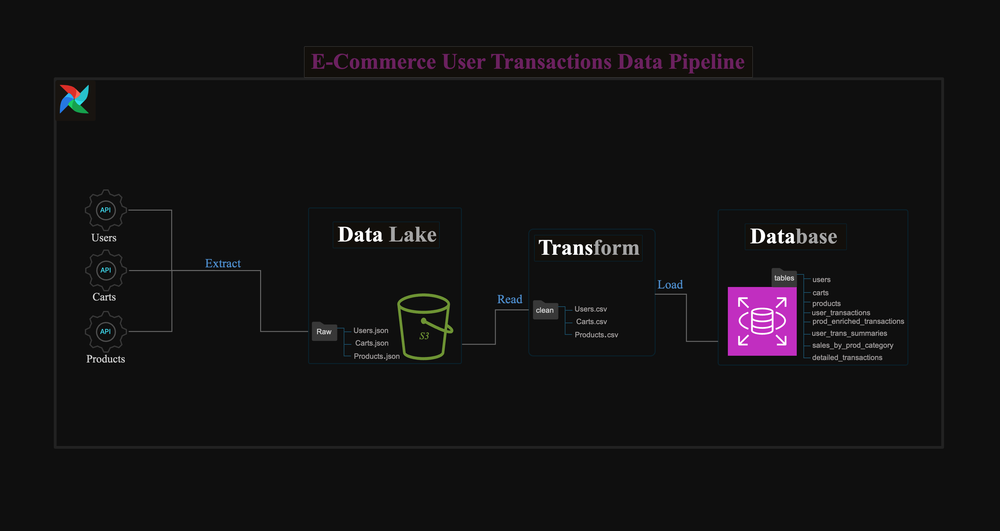
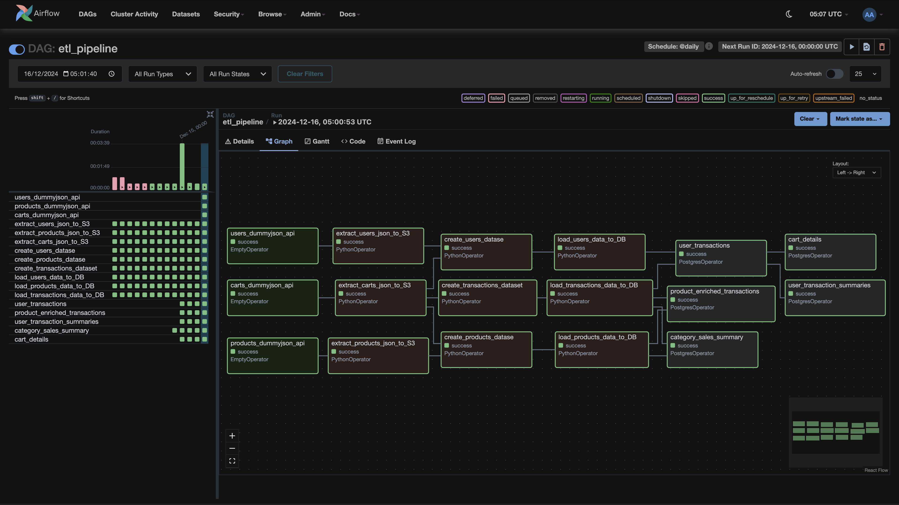
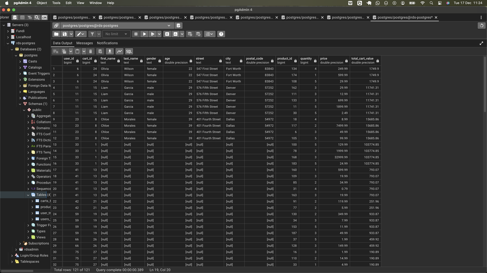
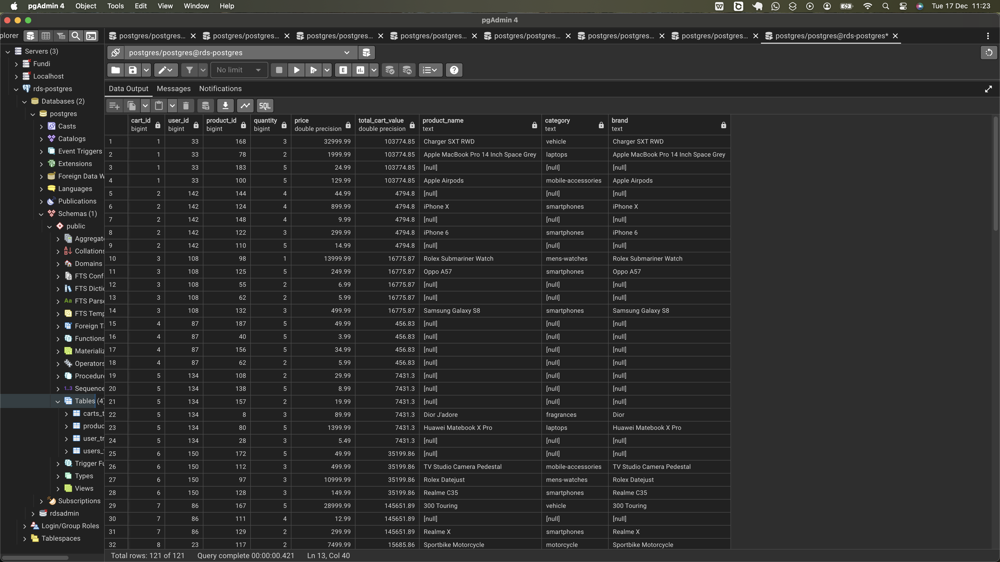
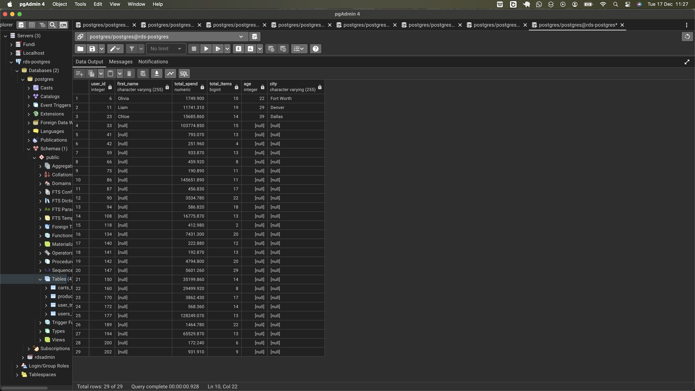
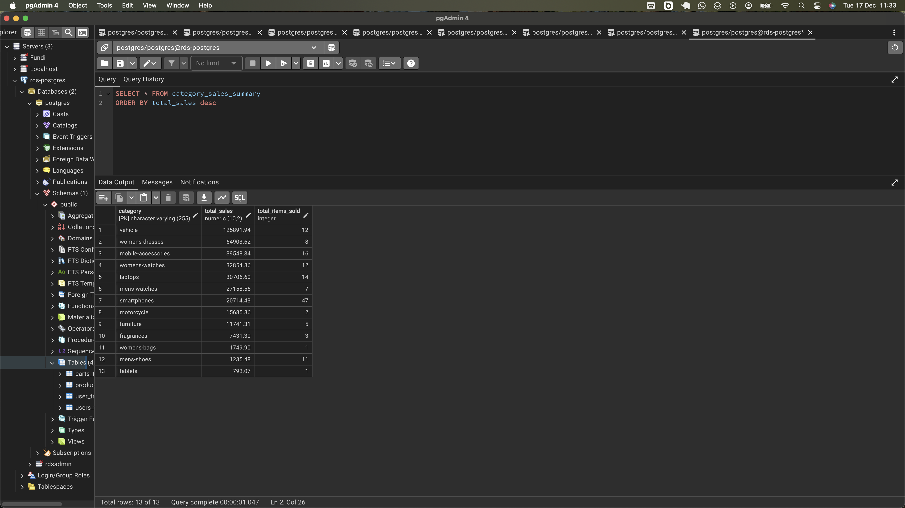
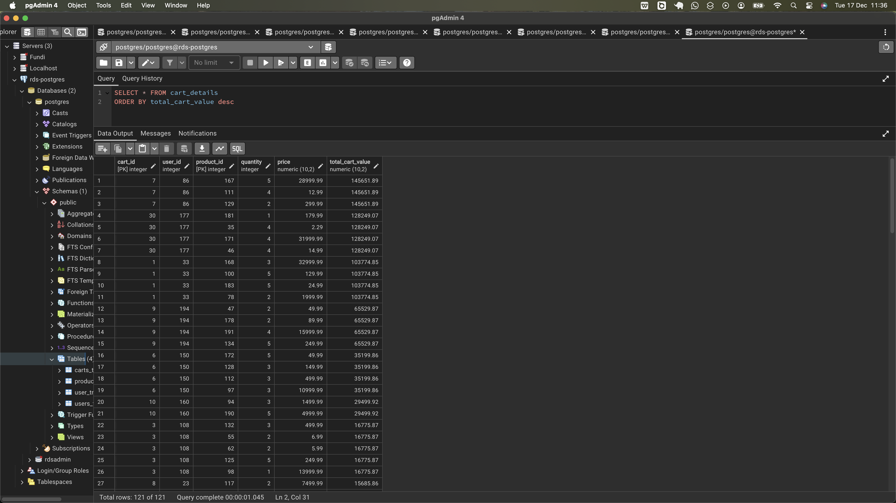

# E-Commerce User Transactions Data Pipeline

The **E-Commerce User Transactions Data Pipeline** is a system designed to extract data from three APIs—users, carts, and products— in batch mode and load the raw JSON data into AWS S3 data lake. The raw data is then processed within the data lake, transforming it into deduplicated, structured datasets. These datasets are then loaded into a data warehouse or database, where they are further enriched and optimized to enable fast and efficient querying. The pipeline aims to enable the analytics team to efficiently answers key business questions, such as:

> - How many users made purchases? What was their total spend, total items, and where are they located? (User Summaries)
> - Which product categories sold the most this season, and what were the total sales per category? (Category Summary)
> - What were the total sales this season?, etc

Below is the high level architecture this project impplements:



Since this pipeline  ensures that valuable insights are readily accessible to support informed business decisions, I will talk about its design and then its implementation.

## **Pipeline Design**

The pipeline is designed and orchestrated to execute various tasks in order of dependencies—from independent to dependent sections of the workflow. For example, we cannot transform data before extracting it, we cannot load data to database before processing it. Therefore it is important to orchestrate tasks in order that operations are performed to ensures success of the workflow, as illustrated in the Airflow DAG graph below.



In this DAG, task execution proceeds from left to right, following a sequential order of stages. Each stage consists of independent nodes, each responsible for specific task in that stage of the pipeline.

The following is an overview of the various stages in the pipeline and their associated tasks.

0. **APIs:** Represented by the first stage column nodes (`_dummyjson_api`), this stages is present solely to indicate that APIs are the source of our transaction data. It does nothing.

1. **Data Extraction and Storage:** Represented by the second layer column nodes (`extract_x_json_to_s3`), this stage collects data from three API sources—users, carts, and products—in batch mode and stores it in an AWS S3 data lake, enabling centralized and scalable data management.

2. **Data Processing:**  Represented by the third layer column nodes (`create_x_dataset`), this stage transforms the raw JSON data into datasets ready for database loading. It involves extracting only the necessary fields and deduplicating the data. Notably, some users and products information present in the cart data did not exist in their respective raw data. To address this, the processing stages for both users and products reference the cart data to incorporate any missing information, ensuring data consistency across all datasets.

3. **Load Processed Data to Database:** Represented by the forth column layer (`load_x_data_to_DB`), this stage loads datasets from previous stage to respective tables in the database/warehouse.

4. **Data Enrichment:** In the data enrichment stage, the pipeline creates two key tables in the database:

- `user_transactions` table for user transactions, generated from the `users_table` and `Carts_table` tables.
- `enriched_transactions` table for transactions/cart data enriched with products details, generated from the `Carts_table` and `products_table` tables.

These two data enrichment tables are created in the `user_transactions` and `product_enriched_transactions` nodes in the workflow, respectively, and each task depends on the completion of the tasks responsible for creating the tables they depend on as shown in the dag workflow.

5. **Metrics**
We aim to create tables of derived metrics associated with user transactions, insights on the top-selling product types, and providing detailed transaction information within the database. I assumed operations related to this to be metric-focused and executed after the data enrichment process is complete. This is what I did in the above workfow orchestration.

- `users_transaction_summaries`: This node creates a table summarizing user transactions. The underlying query relies on the `user_transactions` table, so this task is executed after the `user_transactions` task, which is responsible for creating that table, is complete.

- `carts_details`: This node executes a query to create a table containing detailed cart information (`carts_details`). The query depends on data from the `user_transactions` table, meaning this task is executed after the `user_transactions` task, which creates the referenced table, is completed.

- `category_sales_summary`: This task executed query for aggregating sales data at the product category level. It uses the `carts_table` created by the `load_transactions_data_to_DB` task and the `products_table` created by the `load_products_data_to_DB` task, so it is executed only after both of these tasks are completed.

The logic driving the workflow above is stored in a structured codebase, which we will explore next.

## **Codebase Overview**

The logic for extracting data, loading it into the data lake, create datasets and transferring them to the data warehouse is implemented in the Python. The queries for performing joins and data enrichment within the database is writen in SQL for PostgreSQL. To ensure clarity, the project's codebase is organized into modules, each addressing a specific concern, as outlined below:

```bash
(venv) ubuntu@Airflow:~/airflow$ tree -I "assets|__pycache__|logs"
.
├── config
│   ├── config.py
│   └── __init__.py
├── dag_utils
│   └── etl_helpers.py
├── docker-compose.yaml
├── pipeline_dag.py
├── README.md
├── requirements.txt
└── src
    ├── extract
    │   └── extract_data_to_s3.py
    ├── load
    │   └── db_loader.py
    ├── sql
    │   ├── cart_details.sql
    │   ├── category_sales_summary.sql
    │   ├── enriched_transactions.sql
    │   ├── user_summaries.sql
    │   └── user_transactions.sql
    └── transform
        ├── transform_cart.py
        ├── transform_product.py
        └── transform_user.py

8 directories, 17 files
```

The **src** directory hosts the core components of the pipeline, organized into four subdirectories:  

- **extract**: Contains `extract_data_to_s3.py` scripts that handle data extraction from APIs and load it into AWS S3.
- **transform**: This dir contains Python scripts that specialize in reading and processing processing specialized raw data—such as users, carts, or products—into datasets that are optimized for efficient storage in a database.
  - **`transform_cart.py`**: Processes and cleans raw json cart data, converting it into a structured csv dataset.
  - **`transform_product.py`**: Processes data from two raw sources to create products dataset: the raw products JSON data and the cart JSON data. It extracts the required fields from both sources and union them into a single, deduplicated user dataset.
  - **`transform_user.py`**: Processes data from two raw sources to create users dataset: the raw user JSON data and the cart JSON data. It extracts the required fields from both sources and combines them into a single, deduplicated user dataset.
- **load**: - **load**: This directory contains the `db_loader.py` file, a Python script that includes functions dedicated to loading datasets into the database. It handles the creation of tables with the appropriate schema, sets the primary key, and inserts data into the table from the provided CSV file of transformed data.

- **sql**: The `sql` directory contains a collection of SQL files, each run to perform a specialized task in the database. Here's a brief overview of the files:

    1. **user_transactions.sql**: This file contains SQL queries that join user data with transaction data, specifically combining users' information with their associated cart/transaction details. It provides a comprehensive view of all transactions linked to each individual user.

    2. **enriched_transactions.sql**: This file contains query for enriching raw transaction data with product details and stores the resulting output in the `enriched_transactions` table.

    3. **user_summaries.sql**: This file contains query for summarizing user data based on properties such as total spending, total items purchased, age, and city of residence. It stores the summarized data in the `user_summaries` table that it creates.

    4. **category_sales_summary.sql**: This file aggregates sales data at the product category level, providing insights into the performance of various product categories.

    5. **cart_details.sql**: Query for creating transactions data table detailed by products information.

That covers everything about the **src** directory.

Next, let's look at the `pipeline_dag.py` file located at the root of the project. This file defines the structure of the Airflow DAG, organizing tasks—such as data extraction, transformation, loading, and executing SQL queries—into a sequence of steps to be executed. Importing all the functions required for the ETL processes directly into the `pipeline_dag.py` file would make it overly cluttered. To keep the DAG file clean and focused on its core objective of orchestrating ETL tasks, we use the **dag_utils** directory for import and call functions from the **src** module, which we'll review shortly. First, here’s the content of the `pipeline_dag.py` file.

```python
import os
from airflow import DAG
from dotenv import load_dotenv
from datetime import datetime, timedelta
from airflow.operators.python import PythonOperator
from airflow.operators.dummy import DummyOperator
from airflow.providers.postgres.operators.postgres import PostgresOperator

from dag_utils.etl_helpers import (
    extract_users_data,
    extract_products_data,
    extract_carts_data,
    transform_user_data,
    transform_product_data,
    transform_cart_data,
    load_user_data,
    load_product_data,
    load_cart_data
)

load_dotenv()

default_args = {
    'owner': 'airflow',
    'retries': 1,
    'retry_delay': timedelta(seconds=5)
}

with DAG(
    "etl_pipeline",
    default_args=default_args,
    start_date=datetime(2024, 12, 13),
    template_searchpath=[os.getenv('TEMPS_PATH')],
    schedule_interval="@daily",
    catchup=False
) as dag:

    # Dummy tasks to represent APIs
    fetch_user_data_api = DummyOperator(
        task_id="users_dummyjson_api"
    )

    fetch_prod_data_api = DummyOperator(
        task_id="products_dummyjson_api"
    )

    fetch_carts_data_api = DummyOperator(
        task_id="carts_dummyjson_api"
    )

    # Extract Data from APIs and upload to S3
    fetch_user_data = PythonOperator(
        task_id="extract_users_json_to_S3",
        python_callable=extract_users_data
    )

    fetch_prod_data = PythonOperator(
        task_id="extract_products_json_to_S3",
        python_callable=extract_products_data
    )

    fetch_carts_data = PythonOperator(
        task_id="extract_carts_json_to_S3",
        python_callable=extract_carts_data
    )

    # Transform Data
    create_users_datase = PythonOperator(
        task_id="create_users_datase",
        python_callable=transform_user_data,
        provide_context=True
    )

    create_products_datase = PythonOperator(
        task_id="create_products_datase",
        python_callable=transform_product_data,
        provide_context=True
    )

    transactions_dataset = PythonOperator(
        task_id="create_transactions_dataset",
        python_callable=transform_cart_data,
        provide_context=True
    )

    # Load Datasets to RDS Postgress
    load_users_to_db = PythonOperator(
        task_id="load_users_data_to_DB",
        python_callable=load_user_data,
        provide_context=True
    )

    load_products_to_db = PythonOperator(
        task_id="load_products_data_to_DB",
        python_callable=load_product_data,
        provide_context=True
    )
    
    load_carts_to_db = PythonOperator(
        task_id="load_transactions_data_to_DB",
        python_callable=load_cart_data,
        provide_context=True
    )

    # Database Operations
    user_transactions = PostgresOperator(
        task_id='user_transactions',
        postgres_conn_id='postgress_connection',
        sql='user_transactions.sql',
        dag=dag,
    )

    enriched_transactions = PostgresOperator(
        task_id='product_enriched_transactions',
        postgres_conn_id='postgress_connection',
        sql='enriched_transactions.sql',
        dag=dag,
    )

    user_summaries = PostgresOperator(
        task_id='user_transaction_summaries',
        postgres_conn_id='postgress_connection',
        sql='user_summaries.sql',
        dag=dag,
    )

    category_sales_summary = PostgresOperator(
        task_id='category_sales_summary',
        postgres_conn_id='postgress_connection',
        sql='category_sales_summary.sql',
        dag=dag,
    )
    
    cart_details = PostgresOperator(
        task_id='cart_details',
        postgres_conn_id='postgress_connection',
        sql='cart_details.sql',
        dag=dag,
    )

    # Set task dependencies
    fetch_user_data_api >> fetch_user_data >> create_users_datase
    fetch_carts_data >> create_users_datase
    fetch_prod_data_api >> fetch_prod_data >> create_products_datase
    fetch_carts_data >> create_products_datase
    fetch_carts_data_api >> fetch_carts_data >> transactions_dataset

    create_users_datase >> load_users_to_db
    create_products_datase >> load_products_to_db
    transactions_dataset >> load_carts_to_db

    load_users_to_db >> user_transactions
    load_carts_to_db >> user_transactions

    load_products_to_db >> enriched_transactions
    load_carts_to_db >> enriched_transactions

    user_transactions >> user_summaries
    user_transactions >> cart_details

    load_carts_to_db >> category_sales_summary
    load_products_to_db >> category_sales_summary
```

The **dag_utils** directory contains the `etl_helper.py` file, which imports essential functions from the **src** module and defines helper functions to execute them, with configurations provided either manually or via Airflow XCom. In this file, API URLs, database configuration, and the bucket name are imported from the `config.py` file located in the **config** directory at the root.

Other files in the project include:

- `requirements.txt`: Contains the necessary packages to install for the project.
- `README.md`: Provides a description of the project.
- `docker-compose.yaml`: A manifest used to deploy and run Airflow as a Docker container.

## **Database Queries**

The `db_loader.py` function ealier discussed loads the three datasets, the [users_table](), [products_table](), and [carts_table](), to the database when the `load_users_data_to_DB`, `load_products_data_to_DB`, and `load_transactions_data_to_DB` airflows tasks respectively are executed. From the database, I enriched the data and create tables of derived metrics with sql queries in the following order:

1. **Enriching users data:**

- Query:

```sql
DROP TABLE IF EXISTS user_transactions;

CREATE TABLE IF NOT EXISTS user_transactions (
user_id INT,
cart_id INT,
first_name VARCHAR(255),
last_name VARCHAR(255),
gender VARCHAR(50),
age INT,
street VARCHAR(255),
city VARCHAR(255),
postal_code VARCHAR(20),
product_id INT,
quantity INT,
price DECIMAL(10, 2),
total_cart_value DECIMAL(10, 2),
PRIMARY KEY (user_id, cart_id, product_id)
);

INSERT INTO user_transactions
SELECT
    u.user_id,
    c.cart_id,
    u.first_name,
    u.last_name,
    u.gender,
    u.age,
    u.street,
    u.city,
    u.postal_code,
    c.product_id,
    c.quantity,
    c.price,
    c.total_cart_value
FROM users_table u
FULL JOIN carts_table c
    ON u.user_id = c.user_id
WHERE c.cart_id IS NOT NULL          
ORDER BY u.user_id;
```

This query joins `users_table` with the `carts_table` to create `user_transactions` table. Upon execution, it first deletes the `user_transactions` table from the database if it exists. Then, it creates a new schema for the table, defining constraints and data types for the fields.The schema includes all columns from both the `users_table` and the `carts_table`. The `user_id`, `cart_id`, and `product_id` are set as composite primary key.

Next, an `INSERT` statement is executed to populate the `user_transactions` table. A full join is performed between the two tables, based on `user_id` ensuring that data from both the `users_table` and the `carts_table` is included. A filter is applied to the `cart_id` to include only users who have a corresponding transaction, excluding those without an associated cart_id. Thre resulting table can be found [here](). Also below is a screenshort of the same table.



This table will have some NULL values in some of th fields, which arise from users in the cart who lack sufficient context beyond their `user_id`. However, if historical data is available, we can quickly identify and fill in the missing information for these users.

2. **Enriching transactions data with products:**

- Query:

```sql
DROP TABLE IF EXISTS enriched_transactions;

CREATE TABLE enriched_transactions (
    cart_id INT,
    user_id INT,
    product_id INT,
    quantity INT,
    price DECIMAL(10, 2),
    total_cart_value DECIMAL(10, 2),
    product_name VARCHAR(255),
    category VARCHAR(255),
    brand VARCHAR(255),
    PRIMARY KEY (cart_id, product_id)
);

INSERT INTO enriched_transactions
    SELECT
        c.cart_id,
        c.user_id,
        c.product_id,
        c.quantity,
        COALESCE(c.price, p.price) price,
        c.total_cart_value,
        p.name product_name,
        p.category,
        p.brand
    FROM carts_table c
    LEFT JOIN products_table p
        ON c.product_id = p.product_id;
```

The query joins `carts_table` with the `products_table` to create products enriched transactions table, `enriched_transactions`. When executed first it deleted the `enriched_transactions` table from the database if exists. Next it create schema which defines the field of the table and constraits to the data type they can hold. In this schema I included all columns from the carts and products table. The table set cart_id and product_id as the primary key.

Next is the query for performing LEFT JOIN on ther `carts_table` and `products_table` and the result inserted into this table (`enriched_transactions`). The reason I used the LEFT JOIN is to ensure that all transaction data from the carts_table is retained, while only including product information for those transactions that have associated products.



This table contains NULL values for fields like `product_name`, `category`, and `brand` because these fields reference products with prices ≤ 50 in the cart. The products table, however, only includes details for products with prices > 50 due to the filter applied when processing/transforming data.

3. **Users summary:**

- Query:

```sql
DROP TABLE IF EXISTS user_summaries;

CREATE TABLE user_summaries (
    user_id INT,
    first_name VARCHAR(255),
    total_spend DECIMAL(10, 2),
    total_items INT,
    age INT,
    city VARCHAR(255),
    PRIMARY KEY (user_id)
);

INSERT INTO user_summaries
    SELECT
        user_id,
        first_name,
        ROUND(AVG(total_cart_value), 3) total_spend, -- total cart value
        SUM(quantity) total_items,
        age,
        city
    FROM user_transactions
    GROUP BY user_id, first_name, age, city
    ORDER BY user_id;
```

This query creates a table `user_summaries` to store aggregated user data. It first removes the table if it exists, then creates it with the specified columns: `user_id`, `first_name`, `total_spend`, `total_items`, `age`, and `city`, with a primary key on `user_id`.

The `INSERT` statement populates the table by selecting and aggregating data from the `user_transactions` table. The `SELECT` statement calculates the average of the `total_cart_value` column (rounded to three decimal places) as `total_spend` and sums the `quantity` as `total_items`, which represents the total number of items bought by each user. These metrics are computed from the data at group level of `user_id`, `first_name`, `age`, and `city`, and inserted into the table, ordered by `user_id`. The resulting table can be found [here]().



4. **Sales summary by product category:**

- Query:

```sql
DROP TABLE IF EXISTS category_sales_summary;

CREATE TABLE category_sales_summary (
    category VARCHAR(255),
    total_sales DECIMAL(10, 2),
    total_items_sold INT,
    PRIMARY KEY (category)
);

INSERT INTO category_sales_summary
    WITH combine_trans_prod AS (
        SELECT
            c.cart_id,
            c.user_id,
            c.product_id,
            c.quantity,
            COALESCE(c.price, p.price) price,
            c.total_cart_value,
            p.name product_name,
            p.category,
            p.brand
        FROM carts_table c
        LEFT JOIN products_table p
            ON c.product_id = p.product_id
    )
    SELECT
        category,
        AVG(total_cart_value) AS total_sales,
        SUM(quantity)::INT as total_items_sold
    FROM combine_trans_prod
    WHERE category IS NOT NULL
    GROUP BY category;
```

This query aggregates sales by product category to calculate the total sales amount and the total units of items sold per category. It begins by using a **CTE (Common Table Expression)** to join the transactions data (`cart_table`) with the products data, ensuring all transaction records are preserved via a **LEFT JOIN**. Aggregations are then performed on the CTE results to compute the required totals.  

Finally, the aggregated data is inserted into the `category_sales_summary` table, which is created using the schema defined in the query. Below is a select result on this datable from the database.





5. **Detailed transactions (Cart details).**

- Query:

```sql
DROP TABLE IF EXISTS cart_details;

CREATE TABLE IF NOT EXISTS cart_details (
    cart_id INT,
    user_id INT,
    product_id INT,
    quantity INT,
    price DECIMAL(10, 2),
    total_cart_value DECIMAL(10, 2),
    PRIMARY KEY (cart_id, product_id)
);

INSERT INTO cart_details
SELECT 
    cart_id,
    user_id,
    product_id,
    quantity,
    price,
    total_cart_value
FROM user_transactions
ORDER BY cart_id;
```

This query creates a table `cart_details` to store transaction-level details enriched with user and product data. It first removes the table if it exists, then creates it with the following fields: `cart_id`, `user_id`, `product_id`, `quantity`, `price`, and `total_cart_value`. The `cart_id` and `product_id` columns are set as a composite primary key to uniquely identify each item in a user's cart.

The `INSERT` statement populates the table by selecting the relevant data from the `user_transactions` table, capturing details such as the quantity and price of each product, along with the total cart value. The data is inserted in order of `cart_id` to maintain consistency.



## **Assumptions, and Trade-offs**

**Finding:**

1. The cart data contains transactions from users not present in the current users dataset.  
2. These users only have their IDs available, with no additional details.  
3. Dropping these users would result in losing their transaction data.  
4. Including these users would mean working with incomplete user records.  
5. The dataset was deduplicated to ensure each user appears only once.  

**Assumptions:**  

1. The current users dataset represents users active during the current season.  
2. Historical datasets might exist and could provide additional information about these users based on their IDs.  
3. Including users with only an ID is acceptable for the purpose of completing the dataset, as missing information could potentially be supplemented later.  

**Trade-offs:**  

- **Dropping the users:**  
  - **Pros:** Ensures the dataset consists only of complete user records, avoiding reliance on incomplete data.  
  - **Cons:** Leads to loss of transaction data, reducing the dataset's comprehensiveness.  

- **Including the users:**  
  - **Pros:** Retains all transaction data, preserving the dataset's completeness. Missing information may be recoverable later using IDs.  
  - **Cons:** Requires working with incomplete user records and relies on the assumption that historical data or other sources can fill in the gaps.  

**Decision:**
I chose to include the users from the carts api to the dataset of the users from users api in the data processing phase, so that I can go ahead with a complete data of users.

**Finding**

Some products in the carts data were not in the products data. Since business cant sell products they dont offer, I decided to add them to the products dataset, since manipulating cart products I was able to discover all field corresponding to those in the products dataset, unlike in the case of users where I ended up with null values. As a result of combining the untracked products with products dataset, I ended up with a dataset of [45 distinct products](./data/products_table.csv) unlike the original one which had only 30 products.


- I ignored setting relationship between the tables as the pipeline was not designed for incremental situation and everytime the pipeline runs first deletes the table and then create it again and this lead to error unleass we cascade.

Finally I did not implement testing case for the project and there is potential room for improvement.